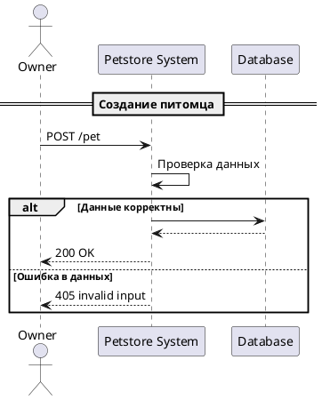

# Сценарий создания питомца

## Описание алгоритма

1. **Owner** отправляет запрос: `POST /pet` с данными питомца.
2. **System** проверяет данные:
   - Если данные корректны:
     - **System** сохраняет данные в **Database**.
     - **System** отправляет **Owner**: `200 OK`.
   - Если данные некорректны:
     - **System** отправляет **Owner**: `405 invalid input`.

