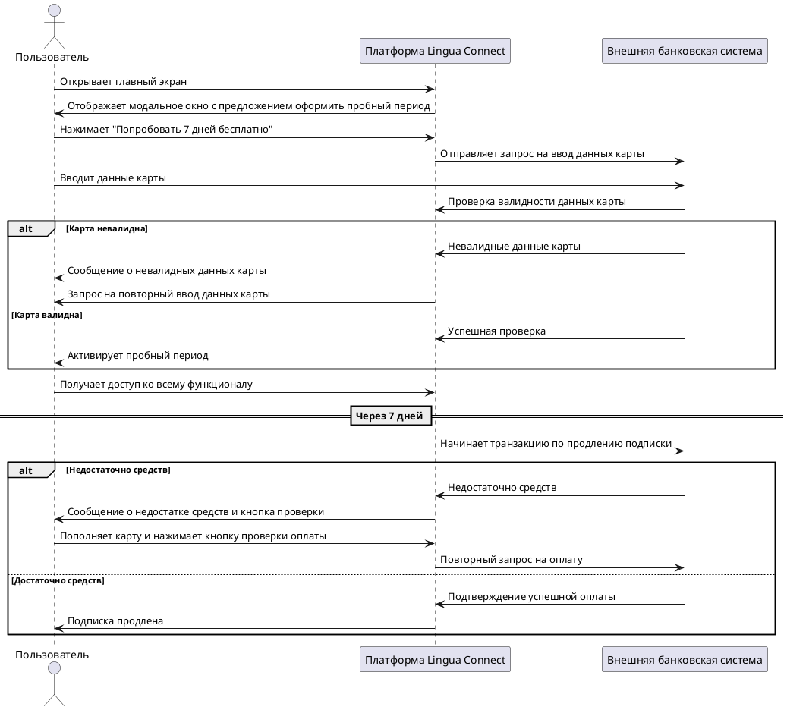

# Сценарий подключения подписки

```plantuml

@startuml
actor Пользователь as User
participant "Платформа Lingua Connect" as System
participant "Внешняя банковская система" as ВБС

User -> System: Открывает главный экран
System -> User: Отображает модальное окно с предложением оформить пробный период
User -> System: Нажимает "Попробовать 7 дней бесплатно"
System -> ВБС: Отправляет запрос на ввод данных карты
User -> ВБС: Вводит данные карты
ВБС -> System: Проверка валидности данных карты

alt Карта невалидна
ВБС -> System: Невалидные данные карты
System -> User: Сообщение о невалидных данных карты
System -> User: Запрос на повторный ввод данных карты
else Карта валидна
ВБС -> System: Успешная проверка
System -> User: Активирует пробный период
end

User -> System: Получает доступ ко всему функционалу

== Через 7 дней ==
System -> ВБС: Начинает транзакцию по продлению подписки

alt Недостаточно средств
ВБС -> System: Недостаточно средств
System -> User: Сообщение о недостатке средств и кнопка проверки
User -> System: Пополняет карту и нажимает кнопку проверки оплаты
System -> ВБС: Повторный запрос на оплату
else Достаточно средств
ВБС -> System: Подтверждение успешной оплаты
System -> User: Подписка продлена
end

@enduml


```
## Описание алгоритма

:::note
Тут описание алгоритма по подключению подписки
:::